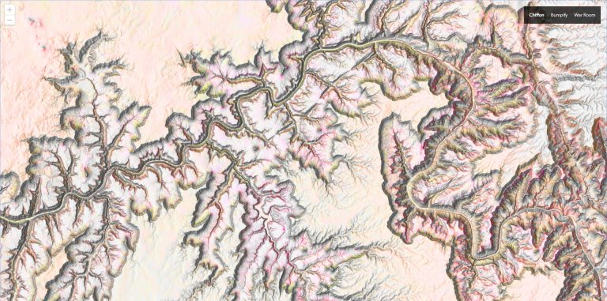
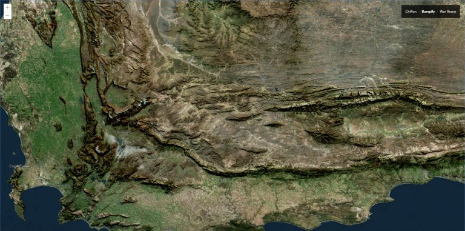
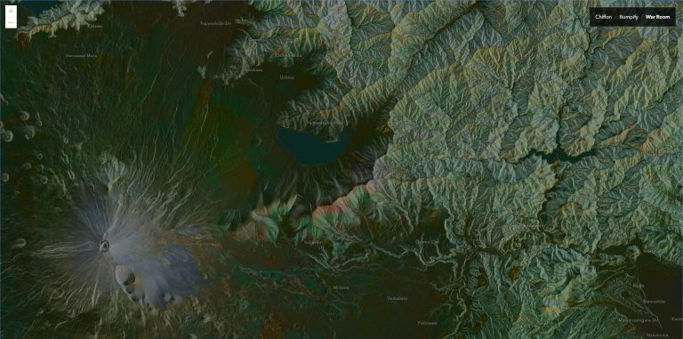

# blend

The ArcGIS API for JavaScript has a cool little hook that exposes browser blend modes for imagery layers. This means you can digitally smash, for example, hillshade pixels into imagery pixels, resulting in all sorts of interesting cartographic concoctions.

This [simple app](https://vannizhang.github.io/blend/) is designed to demo how to use the blend mode property of the JavaScript API to blend layers from the Living Atlas using three different recipes. You can also learn more details about each recipe in the [Blog post](https://www.esri.com/arcgis-blog/products/js-api-arcgis/mapping/hillshade-blending-sorcery-via-javascript-api/).

### Bumpify

### Bumpify

### War Room
